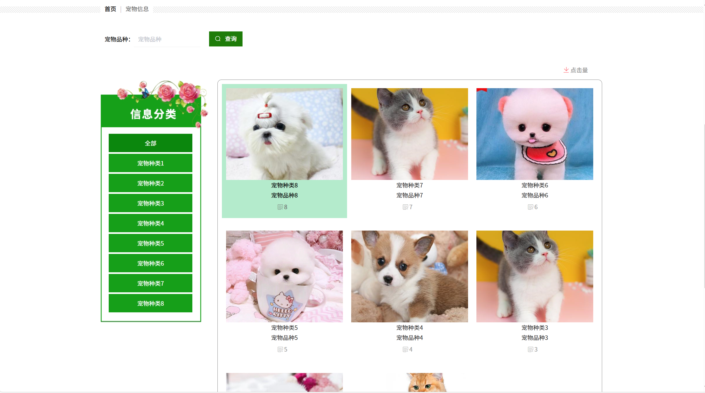

# springbootA419
springbootA419宠物寄养管理系统+LW+PPT
 
## 查看主页获取源码

### 一、关键词

宠物托管管理系统，宠物寄宿管理系统，宠物寄养服务管理系统
 

### 二、作品包含

源码+数据库+设计文档万字+全套环境和工具资源+部署教程

 

### 三、项目技术

前端技术：Html、Css、Js、Vue2.0、Element-ui 
后端技术：Java、SpringBoot2.0、MyBatis

  

 

### 四、运行环境（以下版本亲测，其他版本未知，请自测）

开发工具：IDEA/eclipse  + VSCODE

数据库：MySQL5.7（最低要5.7版本）

数据库管理工具：Navicat10以上版本

环境配置软件： JDK1.8 + Maven3.6.3

前端Nodejs：14

浏览器：谷歌浏览器

 

### 五、项目介绍

项目编号：springbootA419

该系统旨在解决宠物主人在外出旅行或无法照顾宠物时的需求，提供了一个便捷的平台，让宠物主人能够找到信任的寄养者为自己的宠物提供照料服务。系统采用Java语言编写后端逻辑，结合MySQL数据库存储数据，并使用Vue.js框架构建了直观友好的前端界面。
主要设计的内容包括用户管理、宠物信息管理、寄养服务管理、预约寄养管理等。使用用户分为管理员和普通用户。用户可以浏览寄养环境并在线寄养。本系统是信息化社会发展的必然产物，本系统的设计与实现不仅提升了宠物主人的生活质量，也为宠物寄养服务行业的发展提供了新的思路和解决方案。

### 六、运行截图

